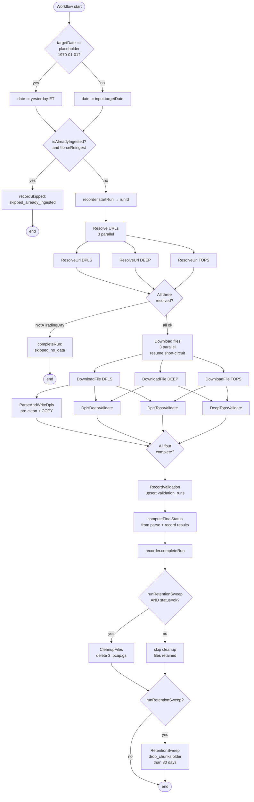

# Temporal pipeline — design and as-built

What the daily ingest pipeline does, how it's wired, what each activity is
responsible for. Reflects what's actually running in `parser/src/main/java/com/longexposure/temporal/`.

> Status: Sprint 1 complete (parse + validate + cleanup + retention).
> Sprint 4+ activities (scoring, narration, cache invalidation) are
> deferred; they live in a separate `DailyNarrationWorkflow` not yet built.

## Workflows

Two workflows registered on task queue `long-exposure-daily-pipeline`:

| Workflow | Trigger | What it does |
|---|---|---|
| `DailyPipelineWorkflow` | cron (midnight ET, paused) + ad-hoc | Full end-to-end: resolve URLs, download 3 feeds, parse DPLS, validate triangle, optionally clean files + sweep retention |
| `ValidateOnlyWorkflow` (`Iface`) | ad-hoc only | Run the 3 validators in parallel against pcap.gz files already on disk; upsert `validation_runs`. Used to re-validate after a parse without re-ingesting |

Both share the same activity registry — only the orchestration logic differs.

---

## `DailyPipelineWorkflow`

### Input

```java
DailyPipelineWorkflowInput(
    LocalDate targetDate,           // trading date (1970-01-01 = "yesterday-ET" placeholder for cron)
    boolean   pollUntilReady,       // true: long-poll on FilesNotReady (15-min, 3-hr budget). false: fail fast.
    boolean   forceReingest,        // true: pre-clean + re-parse even if status='ok' row exists.
    boolean   runRetentionSweep)    // true: drop chunks older than 30 days at end. Also gates CleanupFiles.
```

Helpers: `cron(date)` → `(date, true, false, true)`. `adHoc(date)` → `(date, false, false, false)`.
`adHocForceReingest(date)` → `(date, false, true, false)`.

### Flow



### Status values

Written to `pipeline_runs.status`:

| Value | Meaning |
|---|---|
| `running` | Set by `startRun`, replaced on completion |
| `ok` | Parse + all 3 validation legs passed thresholds |
| `unverified` | Parse ok, validation below threshold (e.g. DPLS↔DEEP dropped below 99.99%) |
| `validation_failed_data_ok` | Parse ok, validation activity threw (NOT a real correctness failure) |
| `parse_failed` | Parse activity exhausted retries |
| `skipped_already_ingested` | `isAlreadyIngested(date)` returned true; no work done |
| `skipped_no_data` | `ResolveUrlActivity` threw `NotATradingDay` (weekend/holiday) |
| `terminated` | Reconciled by the operator after a `temporal workflow terminate` |

---

## `ValidateOnlyWorkflow`

A thin workflow that runs just the 3 validators in parallel against
already-downloaded `.pcap.gz` files. Skips the 30-40 min parse phase when
DB data exists from a prior partial run.

### Input

`LocalDate targetDate` — only argument. Files must exist at
`/storage/raw/YYYYMMDD_IEXTP1_{DPLS1.0,DEEP1.0,TOPS1.6}.pcap.gz`.

### Flow


Trigger via Temporal CLI:

```bash
docker exec long-exposure-dev-temporal temporal workflow start \
  --task-queue long-exposure-daily-pipeline \
  --type Iface --workflow-id validate-YYYYMMDD \
  --input '[YYYY,M,D]'
```

---

## Activities

Ten activity classes total. All share the same `long-exposure-daily-pipeline`
task queue and are registered together in `WorkerMain.start()`.

### `ResolveUrlActivity`

**What.** Hits `https://iextrading.com/api/1.0/hist?date=YYYYMMDD`, parses
the JSON listing, returns the GCS-signed download URL for the requested
`Feed` (DPLS / DEEP / TOPS).

**Failure modes.**

| Condition | Exception | Behavior |
|---|---|---|
| HTTP listing returns `"Not Found"` / empty | `NotATradingDay` | Non-retriable. Workflow → `skipped_no_data` |
| Listing has entries but missing the requested feed | `FilesNotReady` | Retriable in cron mode (15-min interval, 3-hr budget). Non-retriable in ad-hoc mode |
| HTTP 5xx, timeout, DNS failure | `RuntimeException` | Transient-retry (30s × 3) |

**Timeouts.** start-to-close 30s. schedule-to-close 3hr (cron) or 1min (ad-hoc).

### `DownloadFileActivity`

**What.** HTTP GET the GCS-signed URL, stream to `destPath`. Heartbeats
every 50 MB streamed. Resume short-circuit: if `destPath` already exists
at the expected content-length, skip the download.

**Timeouts.** start-to-close 1hr, heartbeat 2min.

**Retry.** Transient retry × 5 on `IOException`. Partial file deleted
before retry to keep the activity idempotent.

### `ParseAndWriteDplsActivity`

**What.**
1. **Pre-clean.** `DELETE FROM <table> WHERE feed_source='DPLS' AND ts >= <date> AND ts < <date>+1` across all 13 DPLS-affected tables. Makes the activity **idempotent** — running it twice gives the same result whether or not there's residual data from a prior failed attempt.
2. **Apply schema** via `SchemaManager.apply()` (idempotent: every DDL is `IF NOT EXISTS`).
3. **Parse + write.** Open the `.pcap.gz`, walk IEX-TP packets, decode via `DplsMessageRouter`, write rows via `TimescaleWriter` (COPY-based, 100 K-row flush). Heartbeats every 100 K messages.

**Tables touched by pre-clean.**

```
DPLS-only:  orders_add, orders_modify, orders_delete, orders_executed, clear_books
Shared w/ TOPS (DPLS rows only): trades, trade_breaks, quotes, status_events,
                                  auction_info, official_prices, securities,
                                  retail_liquidity
```

**Timeouts.** start-to-close 2hr, heartbeat 15min (covers the worst-case
DELETE of a full day's residual rows + COPY-write of 364M rows).

**Retry.** Transient retry × 3 on `RuntimeException`.

### `DplsDeepValidatorActivity`

**What.** Runs `DeepVsDplsValidator` — derives a price-level book from DPLS
order events, compares to DEEP's PLU(transaction-complete) at every
transaction boundary. Independent of TOPS. The load-bearing 100%-match leg.

**Returns.** `ValidationLegResult{compared, matched, mismatched, matchRate, elapsedMs}`.

**Timeouts.** start-to-close 30min. No heartbeat (validator's inner loop
doesn't surface heartbeat points).

### `DplsTopsValidatorActivity`

**What.** Runs `DplsBboCrossValidator` — derives round-lot-protected BBO from
DPLS book state, compares to every TOPS QuoteUpdate. Round-lots from
`IEX_PRIOR_CLOSE_CSV` env if set, else falls back to Reg-NMS tier defaults.

**Timeouts.** Same as DPLS↔DEEP.

### `DeepTopsValidatorActivity`

**What.** Same shape as DPLS→TOPS but the book is DEEP's price-level
aggregate. Should match DPLS→TOPS to the share if both parsers are
bug-equivalent (empirically confirmed: identical match/mismatch counts).

**Timeouts.** Same as DPLS↔DEEP.

### `RecordValidationActivity`

**What.** Takes the three `ValidationLegResult`s, classifies overall status
(see thresholds below), upserts a row to `validation_runs` keyed by
`trading_date`.

**Thresholds.**

| Leg | Threshold | Rationale |
|---|---|---|
| DPLS↔DEEP | ≥ 99.99% | Should be ~100% modulo same-ns multi-txn (10⁻⁸ rate) |
| DPLS→TOPS | ≥ 99% | Empirical floor is ~99.4% — residual is TOPS's internal per-symbol round-lot table |
| DEEP→TOPS | ≥ 99% | Same as DPLS→TOPS |

**Status returned.** `passed` if all three pass. `below_threshold` if any
falls below. `failed` if any leg result is null (its activity threw).

### `CleanupFilesActivity`

**What.** Deletes the 3 `.pcap.gz` files from `/storage/raw/`. Best-effort:
per-file errors logged at WARN, swallowed.

**When called.** Workflow gates on `runRetentionSweep=true AND status=passed`.
Ad-hoc runs (`runRetentionSweep=false`) preserve files for re-run / forensics.

**Retry.** None — single attempt.

### `RetentionSweepActivity`

**What.** Drops chunks older than `cutoffDate - retainDays` (30 days) from
DPLS-only hypertables via TimescaleDB's `drop_chunks()`. For tables shared
with TOPS, per-row `DELETE WHERE feed_source='DPLS' AND ts < cutoff` so the
TOPS validation oracle survives.

**When called.** Only when `input.runRetentionSweep=true` (cron mode).
Failure logged but does NOT fail the workflow (already-completed
parse + validate are real wins; retention is opportunistic).

**Idempotency.** `drop_chunks()` silently skips already-dropped chunks.
Running twice on the same `cutoffDate` is a no-op.

### `PipelineRunRecorderActivity`

**What.** DB-only lifecycle activity. Three methods:

| Method | Effect |
|---|---|
| `isAlreadyIngested(date)` | `SELECT 1 FROM pipeline_runs WHERE trading_date=? AND status='ok'` — used by the workflow's idempotency short-circuit |
| `startRun(date)` | INSERT row with `status='running'`, returns the new `run_id` (UUID) |
| `completeRun(runId, status, parserMessageCount, validatorStatus, notesJson)` | UPDATE the row with completion details |

Fast (no parsing, no IO beyond JDBC), so default retry policy applies.

---

## Schedule

Registered by `WorkerMain.registerSchedule()` on first worker boot:

```
ID:        daily-pipeline-cron
Spec:      '0 0 * * 2-6' America/New_York
Action:    Start DailyPipelineWorkflow with input.cron(PLACEHOLDER_DATE)
Overlap:   SKIP (don't double-fire)
State:     paused (operator unpauses explicitly)
```

The workflow detects `targetDate == 1970-01-01` (`PLACEHOLDER_DATE`) and
resolves to "yesterday in ET" at run time. This is the standard Temporal
pattern for "compute the date at fire time."

**Why paused-by-default.** Avoids dev-time surprises: an in-flight manual
workflow getting doubled by a cron fire at midnight ET (this happened
during Sprint 1 testing). Operator unpauses when ready for nightly
ingestion:

```bash
docker exec long-exposure-dev-temporal temporal schedule toggle \
  --schedule-id daily-pipeline-cron --unpause --reason "go live"
```

---

## Pre-clean — why and how

This is the load-bearing idempotency mechanism. Worth its own section.

### Why

A Temporal activity can be replayed after a transient failure (network
glitch, heartbeat miss, worker restart). Without pre-clean, the second
attempt would write 364 M rows on top of the 200 M rows the first
attempt managed before dying — corrupting the dataset.

With pre-clean, the activity is **truly idempotent**: every attempt
starts from a clean slate for the target date and produces the same
final state. Temporal's retry semantics work as advertised.

### How

`ParseAndWriteDplsActivityImpl.preClean(date)` does:

```sql
DELETE FROM orders_add        WHERE feed_source='DPLS' AND ts >= '<date>' AND ts < '<date>+1';
DELETE FROM orders_modify     WHERE feed_source='DPLS' AND ts >= '<date>' AND ts < '<date>+1';
DELETE FROM orders_delete     WHERE feed_source='DPLS' AND ts >= '<date>' AND ts < '<date>+1';
DELETE FROM orders_executed   WHERE feed_source='DPLS' AND ts >= '<date>' AND ts < '<date>+1';
DELETE FROM clear_books       WHERE feed_source='DPLS' AND ts >= '<date>' AND ts < '<date>+1';
DELETE FROM trades            WHERE feed_source='DPLS' AND ts >= '<date>' AND ts < '<date>+1';
DELETE FROM trade_breaks      WHERE feed_source='DPLS' AND ts >= '<date>' AND ts < '<date>+1';
DELETE FROM quotes            WHERE feed_source='DPLS' AND ts >= '<date>' AND ts < '<date>+1';
DELETE FROM status_events     WHERE feed_source='DPLS' AND ts >= '<date>' AND ts < '<date>+1';
DELETE FROM auction_info      WHERE feed_source='DPLS' AND ts >= '<date>' AND ts < '<date>+1';
DELETE FROM official_prices   WHERE feed_source='DPLS' AND ts >= '<date>' AND ts < '<date>+1';
DELETE FROM securities        WHERE feed_source='DPLS' AND ts >= '<date>' AND ts < '<date>+1';
DELETE FROM retail_liquidity  WHERE feed_source='DPLS' AND ts >= '<date>' AND ts < '<date>+1';
```

Worst case: ~5 min to delete 364 M residual rows on a clean run after a
prior failed attempt. Common case (fresh date): all 13 DELETEs run
in < 1 sec because the rows don't exist.

Pre-clean never touches TOPS or DEEP rows. The shared tables hold both,
and TOPS rows are the validation oracle — clobbering them would break
the validation triangle.

### When the workflow short-circuits pre-clean

`isAlreadyIngested(date)` returns true if `pipeline_runs` has a
`status='ok'` row for that date. With `forceReingest=false` (the default),
the workflow doesn't even call `ParseAndWriteDplsActivity` — it returns
`skipped_already_ingested` immediately. Cheap, correct, default-safe.

With `forceReingest=true` the check is bypassed; the activity runs and
pre-cleans normally before re-writing.

---

## Retry semantics summary

| Activity | start-to-close | heartbeat | retry policy |
|---|---|---|---|
| `ResolveUrl` (cron) | 30s | — | unlimited × 15-min interval, 3-hr schedule-to-close |
| `ResolveUrl` (ad-hoc) | 30s | — | 3 × 15s, no retry on `FilesNotReady` or `NotATradingDay` |
| `DownloadFile` | 1hr | 2min | transient × 5 |
| `ParseAndWriteDpls` | 2hr | 15min | transient × 3 |
| `DplsDeepValidate` | 30min | — | transient × 2 |
| `DplsTopsValidate` | 30min | — | transient × 2 |
| `DeepTopsValidate` | 30min | — | transient × 2 |
| `RecordValidation` | 2min | — | transient × 3 |
| `CleanupFiles` | 5min | — | none (best-effort) |
| `RetentionSweep` | 15min | — | transient × 3 |
| `PipelineRunRecorder` | 30s | — | default × 3 |

`NotATradingDay` is in every activity's `setDoNotRetry` so it always
short-circuits the workflow regardless of which leg threw it.

---

## Where things live

| File | Role |
|---|---|
| `parser/src/main/java/com/longexposure/temporal/WorkerMain.java` | Worker bootstrap: connect to Temporal, register workflows + activities, register cron schedule (paused) |
| `parser/src/main/java/com/longexposure/temporal/workflows/DailyPipelineWorkflow{,Impl,Input}.java` | The cron + ad-hoc workflow |
| `parser/src/main/java/com/longexposure/temporal/workflows/ValidateOnlyWorkflow.java` | Validate-only workflow |
| `parser/src/main/java/com/longexposure/temporal/activities/*.java` | 10 activity interfaces + impls |
| `parser/src/main/resources/schema.sql` | `pipeline_runs` + `validation_runs` table DDL |
| `docs/temporal-design.md` (this file) | What's running and why |

---

## Reconciliation with `README.md` and `docs/architecture.md`

The README and architecture doc were written before any Temporal code
existed and describe a 9-activity serial pipeline. Mapping the
README/arch list to what was actually built:

| README/arch activity | Status |
|---|---|
| `DownloadHistActivity` | ✓ Built — split into `ResolveUrlActivity` + `DownloadFileActivity` |
| `DecompressActivity` | ✗ Skipped — `PcapReader` streams `.pcap.gz` directly via `GZIPInputStream` |
| `ParseTopsActivity` | ✓ Built as `ParseAndWriteDplsActivity` (DPLS, not TOPS — pivoted 2026-05-11) |
| `ValidateDailyTotalsActivity` | ✗ Replaced — triangle validation via 3 leg activities + `RecordValidationActivity` is a stronger correctness check |
| `RefreshBaselinesActivity` | ✗ Sprint 4+ — `daily_volume_by_symbol` cagg refreshes via policy already |
| `ScoreEventsActivity` | ✗ Sprint 4+ — lives in `DailyNarrationWorkflow` (not built) |
| `SelectTopEventsActivity` | ✗ Sprint 4+ — same |
| `NarrateEventsActivity` | ✗ Sprint 4+ — decomposed per `scoring-and-narration.md` two-pass model |
| `StoreNarrativesActivity` | ✗ Sprint 4+ — same |
| `InvalidateCacheActivity` | ✗ Sprint 4+ — companion to narration |
| `CleanupFilesActivity` | ✓ Built |
| `RetentionSweepActivity` | ✓ Built |

**Doc drift to clean up later:**

- README and architecture.md mention **6:00 AM ET** as the trigger time.
  As-built is **midnight ET** (Tue-Sat). Rationale: empirical SLA from
  the IEX HIST listing shows files reliably available between 22:32 and
  00:11 ET; midnight gives aggressive parallel downloads + 3-hour retry
  budget without slipping into morning.
- README/arch describe a serial activity chain
  (`Download → Decompress → Parse → Validate → ...`). As-built is fan-out:
  3 concurrent download branches, then parse + 3 validators in parallel.
- `operations.md` mentions a `ReplayDay` CLI. With Temporal in place,
  replay is just an ad-hoc workflow trigger via Temporal UI or
  `temporal workflow start --type DailyPipelineWorkflow ...`.

These three points are minor and will be folded into the README on the
next pass.

---

## Sprint 1 lessons learned (kept for future-me)

Three things bit during Sprint 1 testing; the as-built reflects the fixes
but the lessons are worth keeping.

1. **Heartbeat timeouts must cover the slowest non-heartbeating SQL or pcap
   pass.** Initial values (parse: 2 min, validate: 5 min) were too tight.
   A pre-clean DELETE of 364 M rows or a 5-min validator inner loop will
   not voluntarily heartbeat; Temporal kills the activity even though the
   work is progressing. Tuned to parse=15 min, validate=no heartbeat
   (start-to-close 30 min is sufficient).

2. **Cron schedules should register paused by default.** A cron fire at
   midnight ET while a manual workflow is mid-parse on the same date is
   a real foot-gun. Schedules now register with `setPaused(true)` and a
   `Note` explaining how to unpause.

3. **`@ActivityMethod` activity-type names default to the capitalized
   method name.** Three different activity interfaces each having
   `validate()` produces three registrations of activity type `"Validate"`
   — Temporal refuses to register them. Fix: explicit
   `@ActivityMethod(name = "...")` per interface.

---

## Unverified-data semantics (Sprint 4+ relevance)

`architecture.md` describes the conservative model: validation failure
flags the date as **unverified**, and downstream activities (scoring,
narration, publishing) refuse to act on unverified data. Adopting this
in `DailyNarrationWorkflow` when it ships:

- `pipeline_runs.status='ok'` → narration eligible
- `pipeline_runs.status='unverified'` → narration skips by default; can be
  forced via a manual flag
- `pipeline_runs.status='validation_failed_data_ok'` → same treatment as
  `unverified` (data is queryable but not narratable)
- Any other status → not narratable

This is Sprint 4+ wiring. For Sprint 1, the validation result is recorded
accurately; the downstream skip-on-unverified behavior lives in
`DailyNarrationWorkflow` when we build it.
