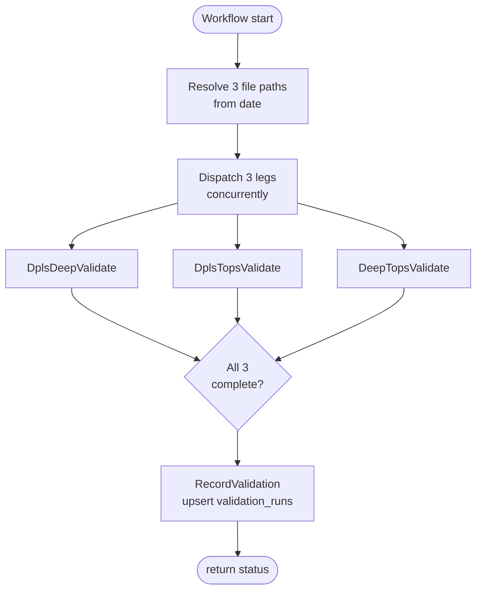

# Temporal pipeline — design and as-built

What the daily ingest pipeline does, how it's wired, what each activity is
responsible for. Reflects what's actually running in `parser/src/main/java/com/longexposure/temporal/`.

> Status: Sprint 1 complete (parse + validate + cleanup + retention).
> Sprint 4+ activities (scoring, narration, cache invalidation) are
> deferred; they live in a separate `DailyNarrationWorkflow` not yet built.

## Workflows

Nineteen workflows registered on task queue `long-exposure-daily-pipeline`. As of Stages 1–6 (2026-05-29 evening, see `decisions.md`), `PipelineWorkflow` is the **universal entry point** for the project — cron, ad-hoc single-day, multi-day backfill, rescore, LLM-only re-runs, and single-stage re-runs all hit the same workflow call. It slides three per-day sub-workflows (`IngestDayWorkflow` → `LlmDayWorkflow` → `FinalizeDayWorkflow`) through a Phase A/B overlap, with rollup cascade after all per-day work completes. `DailyPipelineWorkflow` was previously a 400-line monolith with inline phase wiring; it's now a 110-line composer that calls the same three sub-workflows sequentially (preserving its external `String run(input)` contract — same status strings, same callers untouched).

| Workflow | Trigger | What it does |
|---|---|---|
| `PipelineWorkflow` | cron (midnight ET, paused) + ad-hoc | **Universal entry point.** Accepts `dates` + `dateRanges` (multi-range union, weekday-filtered), `Mode` (FULL_PIPELINE / LLM_CHAIN / SCORE_AND_LLM), optional `Set<Stage>` filter (INGEST / LLM / FINALIZE). Slides per-day work through Phase A/B overlap (IngestDay[N+1] in parallel with LlmDay[N]) then fires the rollup cascade. Replaces all `scripts/rerun-dataset-*.sh` and `scripts/rescore-rerun-*.sh` shell drivers. |
| `DailyPipelineWorkflow` | child of `PipelineWorkflow` (FULL_PIPELINE) + legacy ad-hoc | Per-day orchestrator. Composes `IngestDayWorkflow` → `LlmDayWorkflow` → rollup cascade → `FinalizeDayWorkflow` sequentially. Preserved as a separately-callable workflow for back-compat with operator scripts and the old cron path. |
| `IngestDayWorkflow` | child of `PipelineWorkflow` + `DailyPipelineWorkflow` | Per-day ingest phase. Idempotency check + Download + Parse + Validate (parallel) + RecordValidation + completeRun + Score. Returns status string (`ok` / `unverified` / `parse_failed` / `skipped_*`). luv-side (no joi). |
| `LlmDayWorkflow` | child of `PipelineWorkflow` + `DailyPipelineWorkflow` | Per-day LLM phase. Narrate → Interpret → SynthesizeDay sequentially per the one-LLM-workflow-at-a-time rule. Returns INTERPRET count. joi-bound. |
| `FinalizeDayWorkflow` | child of `PipelineWorkflow` + `DailyPipelineWorkflow` | Per-day finalize phase. CompressChunksActivity + CleanupWorkflow. Takes `{deleteFiles, runRetentionSweep}` so the caller controls file deletion. luv-side. |
| `DownloadWorkflow` | child of IngestDay + ad-hoc | Resolves 3 IEX HIST URLs + downloads 3 `.pcap.gz` files (all 6 ops in parallel). Throws `NotATradingDay` for weekends/holidays so the parent short-circuits. |
| `ParseWorkflow` | child of DailyPipeline + ad-hoc | Parses the DPLS feed into 13 hypertables via JDBC COPY. Idempotent (pre-cleans by trading_date). |
| `ValidateWorkflow` | child of DailyPipeline + ad-hoc | Runs the 3 validators in parallel and upserts `validation_runs`. Returns the per-leg result for the parent to record. |
| `MaterializeWorkflow` | ad-hoc only | Builds the `order_lifecycle` table for a date whose DPLS data is already in Postgres. (DailyPipeline invokes the materialize step via `ScoreWorkflow`, not this workflow, but this exists for ad-hoc backfilling.) |
| `ScoreWorkflow` | child of DailyPipeline + ad-hoc | Refresh baselines cagg → materialize lifecycle + lifetime baseline → run scoring (9 scorers: 7 intraday + 2 inter-day) → enrich co-occurrence → enrich analytics (windowed + book-replay) → select top-N. |
| `SelectWorkflow` | ad-hoc only | Just SelectTopEvents — pulls top-N from existing `scored_events` to `selected_events`. For iterating on per-scorer caps without re-scoring. |
| `NarrateWorkflow` | child of DailyPipeline + ad-hoc | DESCRIBE stage. Two-pass extract → render → verify against the LLM. Writes `narratives`. **LLM-bearing.** |
| `InterpretWorkflow` | child of DailyPipeline + ad-hoc | INTERPRET stage. Per-event LLM call with surrounding ±60-sec wire-data window. Writes `interpretations`. **LLM-bearing.** |
| `SynthesizeDayWorkflow` | child of DailyPipeline + ad-hoc | SYNTHESIZE stage. Single LLM call per day reading all per-event INTERPRET outputs. Writes `daily_synthesis`. **LLM-bearing.** |
| `AggregateWeekWorkflow` | child of DailyPipeline + ad-hoc | AGGREGATE-week stage. Recompute-daily "week-so-far" rollup: one LLM call reading this week's daily syntheses + the prior 13 weekly rollups (one full quarter of trend context, widened 2026-05-28). Content-addressed (`weekly_aggregate.content_hash`) so the daily recompute is incremental. Writes `weekly_aggregate`. **LLM-bearing.** |
| `AggregateQuarterWorkflow` | child of DailyPipeline + ad-hoc | AGGREGATE-quarter stage (Tier B, 2026-05-28). Mirror of weekly one tier up: reads the quarter's ≤13 weekly rollups + prior 4 quarters. **Gated** by `MIN_WEEKS_FOR_QUARTER=8` — returns 0 in <1 sec when not enough weeks accumulated; LLM call only fires when the gate is met. Writes `quarterly_aggregate`. **LLM-bearing (when active).** |
| `AggregateYearWorkflow` | child of DailyPipeline + ad-hoc | AGGREGATE-year stage (Tier B, 2026-05-28). Mirror of quarterly: reads 4 quarterly rollups + prior 2 years. **Gated** by `MIN_QUARTERS_FOR_YEAR=2`. Writes `yearly_aggregate`. **LLM-bearing (when active).** |
| `CleanupWorkflow` | child of DailyPipeline + ad-hoc | Deletes the day's `.pcap.gz` files (only on success) + runs the week-aligned 2-week retention sweep. |
| `RefreshSymbolsWorkflow` | weekly cron (Sun 02:00 ET, paused) + ad-hoc | Refreshes the `symbols` reference table from NASDAQ public listings + SEC EDGAR canonical names + IEX SecurityDirectory. |

**Operational rule (load-bearing):** only one LLM-bearing workflow (`NarrateWorkflow`, `InterpretWorkflow`, `SynthesizeDayWorkflow`, `AggregateWeekWorkflow`, `AggregateQuarterWorkflow`, `AggregateYearWorkflow`) runs at a time. All dispatch on the same `NARRATION_TASK_QUEUE` and share the JVM-wide `Semaphore(2, fair)` inside `LlamaClient`. The quarter + year workflows mostly short-circuit at the gate (no LLM call) but the rule still applies for the days they DO fire. See `docs/operations.md`.

**Composition model.**

`DailyPipelineWorkflow` is *purely* orchestration — its `run()` body reads top-to-bottom as phase names (Download → Parse + Validate in parallel → Score → Narrate → Interpret → SynthesizeDay → CompressChunks → Cleanup) with no embedded activity wiring. Each phase is owned by its child workflow (or, for `CompressChunks`, a direct activity), called via `Workflow.newChildWorkflowStub()` / `newActivityStub()`. This way:

1. **No duplicated wiring** between the cron-driven path and ad-hoc developer-invoked paths. `ScoreWorkflow` is one workflow with one implementation; both paths run the identical code.
2. **Each phase is independently invokable** for replay, backfill, or iterative development.
3. **Each phase has its own retry semantics, history, and Temporal-UI visibility.**

The only direct activity calls remaining in `DailyPipelineWorkflow` are `PipelineRunRecorderActivity.isAlreadyIngested()` / `startRun()` / `completeRun()` — cross-cutting metadata that threads through the orchestration (idempotency check fires first; row gets started at the beginning and updated at the end). Forcing these into a child workflow would invert the natural control flow without any benefit.

Child workflow IDs are auto-generated (avoiding collisions with ad-hoc workflow IDs); `ParentClosePolicy=TERMINATE` ensures killing the parent cleanly cascades to in-flight children.

All workflows share the same activity registry on a single task queue — only the orchestration logic differs.

---

## `DailyPipelineWorkflow`

### Input

```java
DailyPipelineWorkflowInput(
    LocalDate targetDate,           // trading date (1970-01-01 = "yesterday-ET" placeholder for cron)
    boolean   pollUntilReady,       // true: long-poll on FilesNotReady (15-min, 3-hr budget). false: fail fast.
    boolean   forceReingest,        // true: pre-clean + re-parse even if status='ok' row exists.
    boolean   runRetentionSweep)    // true: run the week-aligned 2-week retention sweep at end. Also gates CleanupFiles.
```

Helpers: `cron(date)` → `(date, true, false, true)`. `adHoc(date)` → `(date, false, false, false)`.
`adHocForceReingest(date)` → `(date, false, true, false)`.

### Flow



```mermaid
flowchart TD
    Start([Workflow start]) --> Resolved{targetDate ==<br/>placeholder<br/>1970-01-01?}
    Resolved -->|yes| ResolveDate[date := yesterday-ET]
    Resolved -->|no| UseInput[date := input.targetDate]
    ResolveDate --> Already
    UseInput --> Already

    Already{isAlreadyIngested?<br/>and !forceReingest}
    Already -->|yes| SkipAlready[recordSkipped:<br/>skipped_already_ingested]
    SkipAlready --> EndA([end])

    Already -->|no| StartRun[recorder.startRun → runId]
    StartRun --> ResolveAll

    ResolveAll[Resolve URLs<br/>3 parallel] --> ResolveDPLS[ResolveUrl DPLS]
    ResolveAll --> ResolveDEEP[ResolveUrl DEEP]
    ResolveAll --> ResolveTOPS[ResolveUrl TOPS]

    ResolveDPLS --> AwaitR{All three<br/>resolved?}
    ResolveDEEP --> AwaitR
    ResolveTOPS --> AwaitR

    AwaitR -->|NotATradingDay| SkipNoData[completeRun:<br/>skipped_no_data]
    SkipNoData --> EndB([end])

    AwaitR -->|all ok| Downloads
    Downloads[Download files<br/>3 parallel<br/>resume short-circuit] --> DownloadDPLS[DownloadFile DPLS]
    Downloads --> DownloadDEEP[DownloadFile DEEP]
    Downloads --> DownloadTOPS[DownloadFile TOPS]

    DownloadDPLS --> Parse[ParseAndWriteDpls<br/>pre-clean + COPY]
    DownloadDPLS --> ValDDe
    DownloadDEEP --> ValDDe[DplsDeepValidate]
    DownloadDPLS --> ValDT[DplsTopsValidate]
    DownloadTOPS --> ValDT
    DownloadDEEP --> ValDeT[DeepTopsValidate]
    DownloadTOPS --> ValDeT

    Parse --> AwaitAll
    ValDDe --> AwaitAll
    ValDT --> AwaitAll
    ValDeT --> AwaitAll

    AwaitAll{All four<br/>complete?} --> Record[RecordValidation<br/>upsert validation_runs]
    Record --> Status[computeFinalStatus<br/>from parse + record results]
    Status --> CompleteRun[recorder.completeRun]

    CompleteRun --> ScoreGate{parseError == null?}
    ScoreGate -->|no| Skip[skip scoring +<br/>cleanup]
    ScoreGate -->|yes| Refresh[RefreshBaselines<br/>refresh daily_volume cagg<br/>for the trading day]
    Refresh --> Materialize[MaterializeOrderLifecycle<br/>orders_add ⨝ orders_delete<br/>once → order_lifecycle]
    Materialize --> Score[ScoreEvents<br/>9 scorers → scored_events<br/>PostCancel + Layering read order_lifecycle]
    Score --> Select[SelectTopEvents<br/>percentile-rank → selected_events]
    Select --> Narrate[NarrateEvents — DESCRIBE<br/>two-pass extract+render+verify, retry×3<br/>→ narratives]
    Narrate --> Interpret[InterpretEvents — INTERPRET<br/>per-event surrounding-context LLM, retry×3<br/>→ interpretations]
    Interpret --> Synthesize[SynthesizeDay — SYNTHESIZE<br/>one LLM call across day's events<br/>→ daily_synthesis]
    Synthesize --> Aggregate[AggregateWeek — AGGREGATE<br/>recompute this week's rollup<br/>→ weekly_aggregate]
    Aggregate --> Compress[CompressChunks<br/>compress today's chunks now<br/>~13 GB on disk per day vs ~230 GB uncompressed]
    Compress --> CleanupGate

    CleanupGate{runRetentionSweep<br/>AND status=ok?}
    CleanupGate -->|yes| Cleanup[CleanupFiles<br/>delete 3 .pcap.gz]
    CleanupGate -->|no| KeepFiles[skip cleanup<br/>files retained]
    Skip --> CleanupGate
    Cleanup --> SweepGate
    KeepFiles --> SweepGate

    SweepGate{runRetentionSweep?}
    SweepGate -->|yes| Sweep[RetentionSweep<br/>week-aligned<br/>2-week sweep]
    SweepGate -->|no| EndC
    Sweep --> EndC([end])
```

### Status values

Written to `pipeline_runs.status`:

| Value | Meaning |
|---|---|
| `running` | Set by `startRun`, replaced on completion |
| `ok` | Parse + all 3 validation legs passed thresholds |
| `unverified` | Parse ok, validation below threshold (e.g. DPLS↔DEEP dropped below 99.99%) |
| `validation_failed_data_ok` | Parse ok, validation activity threw (NOT a real correctness failure) |
| `parse_failed` | Parse activity exhausted retries |
| `skipped_already_ingested` | `isAlreadyIngested(date)` returned true; no work done |
| `skipped_no_data` | `ResolveUrlActivity` threw `NotATradingDay` (weekend/holiday) |
| `terminated` | Reconciled by the operator after a `temporal workflow terminate` |

---

## `ValidateWorkflow`

A thin workflow that runs just the 3 validators in parallel against
already-downloaded `.pcap.gz` files. Skips the 30-40 min parse phase when
DB data exists from a prior partial run.

### Input

`LocalDate targetDate` — only argument. Files must exist at
`/storage/raw/YYYYMMDD_IEXTP1_{DPLS1.0,DEEP1.0,TOPS1.6}.pcap.gz`.

### Flow



Trigger via Temporal CLI:

```bash
docker exec long-exposure-dev-temporal temporal workflow start \
  --task-queue long-exposure-daily-pipeline \
  --type ValidateWorkflow --workflow-id validate-YYYYMMDD \
  --input '[YYYY,M,D]'
```

---

## `ScoreWorkflow`

Runs `ScoreEventsActivity` + `SelectTopEventsActivity` against a date
whose DPLS data is already loaded in Postgres. Used for iterating on
scorers or thresholds without re-parsing the source file.

Trigger:

```bash
docker exec long-exposure-dev-temporal temporal workflow start \
  --task-queue long-exposure-daily-pipeline \
  --type ScoreWorkflow --workflow-id score-YYYYMMDD \
  --input '[YYYY,M,D]'
```

---

## `SelectWorkflow`

Just `SelectTopEventsActivity`. Pulls top-N per scorer from existing
`scored_events` into `selected_events`. Used for tuning per-scorer
caps without re-running the multi-minute scoring step.

Trigger:

```bash
docker exec long-exposure-dev-temporal temporal workflow start \
  --task-queue long-exposure-daily-pipeline \
  --type SelectWorkflow --workflow-id select-YYYYMMDD \
  --input '[YYYY,M,D]'
```

---

## Activities

Twenty-eight activity classes total, split across two task queues:

- **Main queue** (`long-exposure-daily-pipeline`): every non-LLM activity. Default Temporal concurrency (200 slots) since none of these saturate a shared bottleneck.
- **Narration queue** (`NARRATION_TASK_QUEUE`): the three LLM-bound activities (`NarrateEventActivity`, `InterpretEventActivity`, `SynthesizeDayActivity`). Worker configured with `setMaxConcurrentActivityExecutionSize(2)` to cap LLM-call concurrency at the GPU's safe parallelism on `llama-large.joi`. The JVM-wide `Semaphore(2, fair)` inside `LlamaClient` is the second-line defense.

The three LLM-bound activities are documented at the bottom of this section; the rest are documented in the order they execute in `DailyPipelineWorkflow`.

### `ResolveUrlActivity`

**What.** Hits `https://iextrading.com/api/1.0/hist?date=YYYYMMDD`, parses
the JSON listing, returns the GCS-signed download URL for the requested
`Feed` (DPLS / DEEP / TOPS).

**Failure modes.**

| Condition | Exception | Behavior |
|---|---|---|
| HTTP listing returns `"Not Found"` / empty | `NotATradingDay` | Non-retriable. Workflow → `skipped_no_data` |
| Listing has entries but missing the requested feed | `FilesNotReady` | Retriable in cron mode (15-min interval, 3-hr budget). Non-retriable in ad-hoc mode |
| HTTP 5xx, timeout, DNS failure | `RuntimeException` | Transient-retry (30s × 3) |

**Timeouts.** start-to-close 30s. schedule-to-close 3hr (cron) or 1min (ad-hoc).

### `DownloadFileActivity`

**What.** HTTP GET the GCS-signed URL, stream to `destPath`. Heartbeats
every 50 MB streamed. Resume short-circuit: if `destPath` already exists
at the expected content-length, skip the download.

**Timeouts.** start-to-close 1hr, heartbeat 2min.

**Retry.** Transient retry × 5 on `IOException`. Partial file deleted
before retry to keep the activity idempotent.

### `ParseAndWriteDplsActivity`

**What.**
1. **Pre-clean.** `DELETE FROM <table> WHERE feed_source='DPLS' AND ts >= <date> AND ts < <date>+1` across all 13 DPLS-affected tables. Makes the activity **idempotent** — running it twice gives the same result whether or not there's residual data from a prior failed attempt.
2. **Apply schema** via `SchemaManager.apply()` (idempotent: every DDL is `IF NOT EXISTS`).
3. **Parse + write.** Open the `.pcap.gz`, walk IEX-TP packets, decode via `DplsMessageRouter`, write rows via `TimescaleWriter` (COPY-based, 100 K-row flush). Heartbeats every 100 K messages.

**Tables touched by pre-clean.**

```
DPLS-only:  orders_add, orders_modify, orders_delete, orders_executed, clear_books
Shared w/ TOPS (DPLS rows only): trades, trade_breaks, quotes, status_events,
                                  auction_info, official_prices, securities,
                                  retail_liquidity
```

**Timeouts.** start-to-close 2hr, heartbeat 15min (covers the worst-case
DELETE of a full day's residual rows + COPY-write of 364M rows).

**Retry.** Transient retry × 3 on `RuntimeException`.

### `DplsDeepValidatorActivity`

**What.** Runs `DeepVsDplsValidator` — derives a price-level book from DPLS
order events, compares to DEEP's PLU(transaction-complete) at every
transaction boundary. Independent of TOPS. The load-bearing 100%-match leg.

**Returns.** `ValidationLegResult{compared, matched, mismatched, matchRate, elapsedMs}`.

**Timeouts.** start-to-close 30min. No heartbeat (validator's inner loop
doesn't surface heartbeat points).

### `DplsTopsValidatorActivity`

**What.** Runs `DplsBboCrossValidator` — derives round-lot-protected BBO from
DPLS book state, compares to every TOPS QuoteUpdate. Round-lots from
`IEX_PRIOR_CLOSE_CSV` env if set, else falls back to Reg-NMS tier defaults.

**Timeouts.** Same as DPLS↔DEEP.

### `DeepTopsValidatorActivity`

**What.** Same shape as DPLS→TOPS but the book is DEEP's price-level
aggregate. Should match DPLS→TOPS to the share if both parsers are
bug-equivalent (empirically confirmed: identical match/mismatch counts).

**Timeouts.** Same as DPLS↔DEEP.

### `RecordValidationActivity`

**What.** Takes the three `ValidationLegResult`s, classifies overall status
(see thresholds below), upserts a row to `validation_runs` keyed by
`trading_date`.

**Thresholds.**

| Leg | Threshold | Rationale |
|---|---|---|
| DPLS↔DEEP | ≥ 99.99% | Should be ~100% modulo same-ns multi-txn (10⁻⁸ rate) |
| DPLS→TOPS | ≥ 99% | Empirical floor is ~99.4% — residual is TOPS's internal per-symbol round-lot table |
| DEEP→TOPS | ≥ 99% | Same as DPLS→TOPS |

**Status returned.** `passed` if all three pass. `below_threshold` if any
falls below. `failed` if any leg result is null (its activity threw).

### `MaterializeOrderLifecycleActivity`

**What.** Builds the `order_lifecycle` hypertable for one trading date.
One row per order: `(trading_date, symbol, order_id, side, add_ts,
add_ts_nanos, add_price_raw, add_size, delete_ts, execute_ts,
terminal_state, lifetime_ns, feed_source)`. Pairs each `orders_add`
row with its terminal event (Delete OR latest Execute) via a single
JOIN; orders that survive end-of-session land with `lifetime_ns=NULL`,
`terminal_state='open'`.

**Why it exists.** The Add ↔ Delete pairing JOIN is the most expensive
query in the daily pipeline (162 M × 160 M rows, ~13 GB hash table).
Materializing once between Parse and Score means every downstream
scorer queries a partial-indexed sequential scan instead of the JOIN.
PostCancel + Layering drop from ~20 min each to under a minute. See
`docs/decisions.md` 2026-05-18 for full rationale.

**SQL shape.** A CTE first builds "last execute per (order_id,
feed_source)" via `SELECT DISTINCT ON … ORDER BY order_id, ts DESC`
over the small `orders_executed` table (~2.4 M rows/day). The main
`INSERT … SELECT` then does two hash JOINs (`orders_add` ⨯
`orders_delete`, `orders_add` ⨯ the CTE). Earlier draft used a
`LATERAL ... LIMIT 1` per row — replaced because that would have
been 162 M nested-loop seeks.

**Idempotency.** Pre-cleans `order_lifecycle` for the target
trading_date before populating. Repeated runs converge.

**Memory tuning.** Sets `SET work_mem='4GB'` for the duration of the
materialize transaction. With `hash_mem_multiplier=2` (server-side)
and 16 parallel workers, peak hash-table budget is 16 × 4 × 2 = 128 GB
ceiling (bounded by the postgres container `mem_limit=48g`). Resets
when the activity completes.

**Timeouts.** start-to-close 60 min, heartbeat 15 min. Background
heartbeat thread fires every 60 s while the JOIN runs.

**Retry.** Transient retry × 2.

### `ScoreEventsActivity`

**What.** Runs every `EventScorer` in `EventScorerRegistry.ALL` against
the day's data and writes results to `scored_events`. Detailed
algorithm in `docs/scoring-and-narration.md`.

**Lifecycle dependency.** Post-2026-05-18 refactor, `PostCancelClusterScorer`
and `LayeringScorer` query `order_lifecycle` (populated by the upstream
`MaterializeOrderLifecycleActivity`) instead of the raw
`orders_add`/`orders_delete` tables. The other 5 scorers are unchanged
— they read `status_events`/`trades`/`orders_executed`/`orders_delete`
directly.

**Memory model.** Push model — each scorer emits `ScoredEvent` via a
`Consumer` callback. The activity buffers up to 10K rows of COPY text
then flushes to Postgres. Memory bounded to ~per-cluster state inside
the scorer (typically < 1 MB).

**JDBC.** Sets `setAutoCommit(false)` before any scorer runs. Critical:
Postgres's JDBC driver silently ignores `setFetchSize` in autoCommit
mode and buffers entire result sets, which OOMs on the JOIN-heavy
scorers. autoCommit=false enables server-side cursor + fetch-by-batch.

**Background heartbeat.** Daemon thread fires `actx.heartbeat()` every
60s so the activity stays alive while Postgres queries are running
with no rows yielded yet.

**Per-scorer isolation.** Each scorer's `score()` call wrapped in
try/catch. Normal exceptions log + heartbeat "scorer_failed" + continue
with next scorer. `OutOfMemoryError` re-thrown so the JVM's
`ExitOnOutOfMemoryError` fires cleanly.

**Timeouts.** start-to-close 90min, heartbeat 15min.

**Retry.** Transient retry × 2.

### `SelectTopEventsActivity`

**What.** Per-scorer top-N pull from `scored_events` into
`selected_events`. Pre-cleans `selected_events` for the date, then runs
one `INSERT INTO selected_events SELECT ... LIMIT N` per scorer
according to the hardcoded `PER_SCORER_CAPS` map (~90 rows/day).

**Timeouts.** start-to-close 5min. Typical runtime < 2 sec.

**Retry.** Transient retry × 2.

### `CleanupFilesActivity`

**What.** Deletes the 3 `.pcap.gz` files from `/storage/raw/`. Best-effort:
per-file errors logged at WARN, swallowed.

**When called.** Workflow gates on `runRetentionSweep=true AND status=passed`.
Ad-hoc runs (`runRetentionSweep=false`) preserve files for re-run / forensics.

**Retry.** None — single attempt.

### `CompressChunksActivity`

**What.** Compresses every uncompressed TimescaleDB chunk whose time
range overlaps the trading date, across all compression-enabled
hypertables. Calls `compress_chunk()` per chunk with a Temporal
heartbeat between each (the largest single chunk, the 75 GB
`order_lifecycle` chunk, takes ~7 min on its own). Idempotent — chunks
already compressed are not in the candidate set.

**Why this exists alongside the `add_compression_policy(..., INTERVAL '1 day')`
configured in `schema.sql`**: the policy runs on TimescaleDB's internal
job scheduler (default daily), so during a multi-day backfill or
intra-day re-run, a day's ~230 GB of uncompressed data would sit on
disk until the next scheduled policy run. The activity compresses
immediately at the end of `DailyPipelineWorkflow` so steady-state disk
use stays ~13 GB/day from minute one. The schema policy stays as a
steady-state safety net for any chunks the activity missed (e.g., on
an activity failure).

**Empirical baseline**: a full day's chunks (39 chunks on 2026-05-08,
peak ~75 GB on order_lifecycle) compresses in ~26 min single-threaded.

**Timeouts.** start-to-close 60 min, heartbeat 10 min. transient × 2.

### `RetentionSweepActivity`

**What.** Week-aligned rolling 2-full-weeks retention. The drop boundary is
`weekBoundary(cutoffDate, RETENTION_WEEKS=2)` = `Monday(cutoffDate) − 2 weeks`
(pure + unit-tested), so we keep the current partial week + the 2 most-recent
completed weeks and never dip below 2 full weeks. Drops DPLS-only hypertables
(incl. derived `order_lifecycle`) via `drop_chunks()`; for tables shared with
TOPS, per-row `DELETE WHERE feed_source='DPLS' AND ts < boundary` so the TOPS
validation oracle survives; `scored_events`/`selected_events` DELETE by
`trading_date`. **Never touches** `daily_volume_by_symbol` (the baseline cagg
outlives wire retention by design) or the narrative-layer tables
(`narratives`/`interpretations`/`daily_synthesis`/`weekly_aggregate`, kept
indefinitely). See `decisions.md` 2026-05-25.

**When called.** Only when `input.runRetentionSweep=true` (cron mode).
Failure logged but does NOT fail the workflow (already-completed
parse + validate are real wins; retention is opportunistic).

**Idempotency.** `drop_chunks()` silently skips already-dropped chunks.
Running twice on the same `cutoffDate` is a no-op.

### `PruneStaleNarrationsActivity`

**What.** Collapses superseded narration / interpretation rows down to
the latest verifier-passing row per content-key. Two-arg shape:
{@code pruneDate(date)} (cheap, per-day cron path) or {@code pruneAll()}
(backfill cleanup).

**Keep rule.** Per content-key `(trading_date, symbol, event_type,
event_ts)` keep rank 1 by `(verifier_passed DESC, created_at DESC)`.
Latest passing row wins; if none passed, latest overall wins (never
delete an event's only narration). Drop everything else.

**Why reachability-free.** Does NOT join `selected_events` — so it
preserves the narrative archive forever even after wire-data
retention drops `selected_events` for old dates. The narrative
tables are the product; this activity keeps them lean without
risking the archive.

**When called.** Last step of `FinalizeDayWorkflow`. Per the
operations rule, only fires when FinalizeDay runs (Mode.FULL_PIPELINE
in PipelineWorkflow). LLM_CHAIN and SCORE_AND_LLM modes skip
FinalizeDay; operators kick a separate `stages=[FINALIZE]` pass for
cleanup, or run `pruneAll()` directly.

**Idempotency.** Window-function DELETE; running twice deletes
nothing the second time. Steady-state cron days produce zero rows
to delete (each event narrated once); meaningful work only when
re-runs have accumulated multiple hashes per content-key.

### `RetainRawFilesActivity`

**What.** Wall-clock TTL on raw `.pcap.gz` files in
`IEX_RAW_DIR` (default `/storage/raw`). Walks the directory,
parses the `YYYYMMDD` stem from each filename matching
`<date>_IEXTP1_<FEED><VERSION>.pcap.gz`, deletes anything older
than `retainDays` (FinalizeDay calls with `RAW_FILE_RETAIN_DAYS=3`).

**Why separate from `CleanupFilesActivity`.** Cleanup deletes the
three files for the trading date that JUST finished, gated by
`runRetentionSweep && status==ok`. Two foot-guns: ad-hoc re-runs
(`runRetentionSweep=false`) accumulate files indefinitely, and the
gate keys off run status rather than wall-clock age (a failed
parse leaves the file behind forever). This activity decouples
raw-file lifecycle from pipeline-status — wall-clock TTL,
unconditional.

**When called.** End of `FinalizeDayWorkflow`. Same Mode-gating
caveat as the prune above.

**Tuning.** IEX HIST is free + always available, ~10 min to
re-download. 3 days covers "yesterday's pipeline failed, rerun
today" without holding more. If a future use case wants longer
local retention (e.g., re-validate after a parser change without
re-downloading), bump `RAW_FILE_RETAIN_DAYS` in `FinalizeDayWorkflowImpl`.

### `PipelineRunRecorderActivity`

**What.** DB-only lifecycle activity. Three methods:

| Method | Effect |
|---|---|
| `isAlreadyIngested(date)` | `SELECT 1 FROM pipeline_runs WHERE trading_date=? AND status='ok'` — used by the workflow's idempotency short-circuit |
| `startRun(date)` | INSERT row with `status='running'`, returns the new `run_id` (UUID) |
| `completeRun(runId, status, parserMessageCount, validatorStatus, notesJson)` | UPDATE the row with completion details |

Fast (no parsing, no IO beyond JDBC), so default retry policy applies.

### `ListSelectedEventsActivity`

**What.** Tiny lookup activity that returns the `selected_id` list for a date. Used by `NarrateWorkflow` and `InterpretWorkflow` to fan out their per-event activities (workflow code can't do JDBC directly). One small `SELECT … ORDER BY selected_id`.

**Timeouts.** start-to-close 30 sec. Default retry × 3.

### `NarrateEventActivity` — DESCRIBE per event

**What.** One activity invocation per selected event. Loads the row from `selected_events`, runs the two-pass extract → render → verify pipeline via `NarrationPipeline`, upserts a `narratives` row keyed by `event_hash`.

**Concurrency.** Runs on the narration task queue. Worker capped at 2 concurrent. JVM-wide `Semaphore(2, fair)` in `LlamaClient` is the second-line defense.

**Timeouts.** start-to-close 5 min (each event ≈ 16 sec across 2 LLM calls; 5 min covers tail latency). schedule-to-close 1 hr.

**Retry.** transient × 2.

### `InterpretEventActivity` — INTERPRET per event

**What.** One activity invocation per selected event. Loads the row from `selected_events` (with `ts_end`), queries the ±60-sec pre/post trade windows via `TradeWindow.query()`, calls the LLM once with `SamplingParams.RENDER`, runs `InterpretationVerifier`, upserts an `interpretations` row keyed by SHA256 of inputs + prompt version + model id.

**Concurrency.** Same narration task queue as `NarrateEventActivity`. Shares the 2-concurrent cap.

**Prompt versioning.** The `PROMPT_VERSION` constant is baked into the hash, so a prompt change invalidates the cache. Today's value is `interpret-v5-2026-05-22-no-approximation` (after 5 iterations chasing precision, unit-conversion, ticker-presence, and approximation patterns).

**Timeouts.** start-to-close 5 min. schedule-to-close 1 hr. transient × 2.

### `SynthesizeDayActivity` — SYNTHESIZE day

**What.** One activity invocation per trading date. Loads every narration + interpretation for the day, computes day-level aggregates (`by_scorer`, `by_session_phase`, `top_symbols_by_event_count`), builds a ~16K-token prompt (INTERP-only per event to fit joi's `n_ctx=32768`), calls the LLM once with `SamplingParams.SYNTHESIZE` (Qwen instruct-reasoning mode), runs `SynthesisVerifier` (ticker fabrication + magnitude-tolerant number grounding), upserts `daily_synthesis` (PK = trading_date).

**Concurrency.** Same narration task queue. Only one call per day, so doesn't push against the 2-concurrent cap on its own — but per the operational rule, must not run concurrently with `NarrateWorkflow` / `InterpretWorkflow`.

**Timeouts.** start-to-close 5 min. transient × 2.

---

## Schedule

Registered by `WorkerMain.registerSchedule()` on first worker boot:

```
ID:        daily-pipeline-cron
Spec:      '0 0 * * 2-6' America/New_York
Action:    Start DailyPipelineWorkflow with input.cron(PLACEHOLDER_DATE)
Overlap:   SKIP (don't double-fire)
State:     paused (operator unpauses explicitly)
```

The workflow detects `targetDate == 1970-01-01` (`PLACEHOLDER_DATE`) and
resolves to "yesterday in ET" at run time. This is the standard Temporal
pattern for "compute the date at fire time."

**Why paused-by-default.** Avoids dev-time surprises: an in-flight manual
workflow getting doubled by a cron fire at midnight ET (this happened
during Sprint 1 testing). Operator unpauses when ready for nightly
ingestion:

```bash
docker exec long-exposure-dev-temporal temporal schedule toggle \
  --schedule-id daily-pipeline-cron --unpause --reason "go live"
```

---

## Pre-clean — why and how

This is the load-bearing idempotency mechanism. Worth its own section.

### Why

A Temporal activity can be replayed after a transient failure (network
glitch, heartbeat miss, worker restart). Without pre-clean, the second
attempt would write 364 M rows on top of the 200 M rows the first
attempt managed before dying — corrupting the dataset.

With pre-clean, the activity is **truly idempotent**: every attempt
starts from a clean slate for the target date and produces the same
final state. Temporal's retry semantics work as advertised.

### How

`ParseAndWriteDplsActivityImpl.preClean(date)` does:

```sql
DELETE FROM orders_add        WHERE feed_source='DPLS' AND ts >= '<date>' AND ts < '<date>+1';
DELETE FROM orders_modify     WHERE feed_source='DPLS' AND ts >= '<date>' AND ts < '<date>+1';
DELETE FROM orders_delete     WHERE feed_source='DPLS' AND ts >= '<date>' AND ts < '<date>+1';
DELETE FROM orders_executed   WHERE feed_source='DPLS' AND ts >= '<date>' AND ts < '<date>+1';
DELETE FROM clear_books       WHERE feed_source='DPLS' AND ts >= '<date>' AND ts < '<date>+1';
DELETE FROM trades            WHERE feed_source='DPLS' AND ts >= '<date>' AND ts < '<date>+1';
DELETE FROM trade_breaks      WHERE feed_source='DPLS' AND ts >= '<date>' AND ts < '<date>+1';
DELETE FROM quotes            WHERE feed_source='DPLS' AND ts >= '<date>' AND ts < '<date>+1';
DELETE FROM status_events     WHERE feed_source='DPLS' AND ts >= '<date>' AND ts < '<date>+1';
DELETE FROM auction_info      WHERE feed_source='DPLS' AND ts >= '<date>' AND ts < '<date>+1';
DELETE FROM official_prices   WHERE feed_source='DPLS' AND ts >= '<date>' AND ts < '<date>+1';
DELETE FROM securities        WHERE feed_source='DPLS' AND ts >= '<date>' AND ts < '<date>+1';
DELETE FROM retail_liquidity  WHERE feed_source='DPLS' AND ts >= '<date>' AND ts < '<date>+1';
```

Worst case: ~5 min to delete 364 M residual rows on a clean run after a
prior failed attempt. Common case (fresh date): all 13 DELETEs run
in < 1 sec because the rows don't exist.

Pre-clean never touches TOPS or DEEP rows. The shared tables hold both,
and TOPS rows are the validation oracle — clobbering them would break
the validation triangle.

### When the workflow short-circuits pre-clean

`isAlreadyIngested(date)` returns true if `pipeline_runs` has a
`status='ok'` row for that date. With `forceReingest=false` (the default),
the workflow doesn't even call `ParseAndWriteDplsActivity` — it returns
`skipped_already_ingested` immediately. Cheap, correct, default-safe.

With `forceReingest=true` the check is bypassed; the activity runs and
pre-cleans normally before re-writing.

---

## Retry semantics summary

| Activity | start-to-close | heartbeat | retry policy |
|---|---|---|---|
| `ResolveUrl` (cron) | 30s | — | unlimited × 15-min interval, 3-hr schedule-to-close |
| `ResolveUrl` (ad-hoc) | 30s | — | 3 × 15s, no retry on `FilesNotReady` or `NotATradingDay` |
| `DownloadFile` | 1hr | 2min | transient × 5 |
| `ParseAndWriteDpls` | 2hr | 15min | transient × 3 |
| `DplsDeepValidate` | 30min | — | transient × 2 |
| `DplsTopsValidate` | 30min | — | transient × 2 |
| `DeepTopsValidate` | 30min | — | transient × 2 |
| `RecordValidation` | 2min | — | transient × 3 |
| `RefreshBaselines` | 15min | — | transient × 2 |
| `MaterializeOrderLifecycle` | 60min | 15min | transient × 2 |
| `ScoreEvents` | 90min | 15min | transient × 2 |
| `SelectTopEvents` | 5min | — | transient × 2 |
| `ListSelectedEvents` | 30s | — | default × 3 |
| `NarrateEvent` (LLM) | 5min | 1min | transient × 2 |
| `InterpretEvent` (LLM) | 5min | 1min | transient × 2 |
| `SynthesizeDay` (LLM) | 5min | 1min | transient × 2 |
| `AggregateWeek` (LLM) | 5min | 1min | transient × 2 |
| `CleanupFiles` | 5min | — | none (best-effort) |
| `CompressChunks` | 60min | 10min | transient × 2 |
| `RetentionSweep` | 15min | — | transient × 3 |
| `PruneStaleNarrations` | 10min | — | transient × 2 |
| `RetainRawFiles` | 5min | — | transient × 2 |
| `PipelineRunRecorder` | 30s | — | default × 3 |

`NotATradingDay` is in every activity's `setDoNotRetry` so it always
short-circuits the workflow regardless of which leg threw it.

---

## Where things live

| File | Role |
|---|---|
| `parser/src/main/java/com/longexposure/temporal/WorkerMain.java` | Worker bootstrap: connect to Temporal, register workflows + activities, register cron schedule (paused) |
| `parser/src/main/java/com/longexposure/temporal/workflows/DailyPipelineWorkflow{,Impl,Input}.java` | Top-level orchestrator. Pure orchestration logic — calls only child workflows + `PipelineRunRecorderActivity` for metadata. |
| `parser/src/main/java/com/longexposure/temporal/workflows/{Download,Parse,Validate,Materialize,Score,Select,Narrate,Cleanup}Workflow{,Impl}.java` | Phase workflows — each owns one phase. Called as child workflows from `DailyPipelineWorkflow` and as standalone entry points for ad-hoc developer invocation. |
| `parser/src/main/java/com/longexposure/temporal/workflows/{DownloadResult,DailyPipelineWorkflowInput,DownloadWorkflow.Input,ParseWorkflow.Input,CleanupWorkflow.Input}.java` | Records used as phase-workflow inputs/outputs |
| `parser/src/main/java/com/longexposure/temporal/workflows/RefreshSymbolsWorkflow{,Impl}.java` | Weekly symbols-refresh workflow (separate cron) |
| `parser/src/main/java/com/longexposure/temporal/activities/*.java` | 28 activity interfaces + impls |
| `parser/src/main/resources/schema.sql` | `pipeline_runs` + `validation_runs` table DDL |
| `docs/temporal-design.md` (this file) | What's running and why |

---

## Reconciliation with `README.md` and `docs/architecture.md`

The README and architecture doc were written before any Temporal code
existed and describe a 9-activity serial pipeline. Mapping the
README/arch list to what was actually built:

| README/arch activity | Status |
|---|---|
| `DownloadHistActivity` | ✓ Built — split into `ResolveUrlActivity` + `DownloadFileActivity` |
| `DecompressActivity` | ✗ Skipped — `PcapReader` streams `.pcap.gz` directly via `GZIPInputStream` |
| `ParseTopsActivity` | ✓ Built as `ParseAndWriteDplsActivity` (DPLS, not TOPS — pivoted 2026-05-11) |
| `ValidateDailyTotalsActivity` | ✗ Replaced — triangle validation via 3 leg activities + `RecordValidationActivity` is a stronger correctness check |
| `RefreshBaselinesActivity` | ✓ Built (2026-05-26) — explicit `refresh_continuous_aggregate` as the first `ScoreWorkflow` step, ahead of the inter-day scorer |
| `ScoreEventsActivity` | ✓ Built — runs the 8-scorer registry inside `ScoreWorkflow` |
| `SelectTopEventsActivity` | ✓ Built — within-scorer percentile-rank selection |
| `NarrateEventsActivity` | ✓ Built as `NarrateEventActivity` — decomposed into the two-pass `NarrationPipeline` (extract → render → verify) per `scoring-and-narration.md`, with verifier-driven retry |
| `StoreNarrativesActivity` | ✓ Folded into `NarrateEventActivity` (upsert by `event_hash` is the store step) |
| `InvalidateCacheActivity` | ✗ Not needed — content-addressing handles it by construction: `event_hash` includes breakdown + prompt versions, so a changed input is simply a new key (no explicit invalidation) |
| `CleanupFilesActivity` | ✓ Built |
| `RetentionSweepActivity` | ✓ Built (week-aligned 2-week) |
| `MaterializeOrderLifecycleActivity` / `EnrichWithCoOccurrenceActivity` / `InterpretEventActivity` / `SynthesizeDayActivity` / `AggregateWeekActivity` / `CompressChunksActivity` / `ListSelectedEventsActivity` | ✓ Built — added beyond the original README/arch list (lifecycle materialization, co-occurrence enrichment, INTERPRET, SYNTHESIZE, AGGREGATE, in-place compression, the narrate/interpret fan-out helper) |

**Doc drift to clean up later:**

- README and architecture.md mention **6:00 AM ET** as the trigger time.
  As-built is **midnight ET** (Tue-Sat). Rationale: empirical SLA from
  the IEX HIST listing shows files reliably available between 22:32 and
  00:11 ET; midnight gives aggressive parallel downloads + 3-hour retry
  budget without slipping into morning.
- README/arch describe a serial activity chain
  (`Download → Decompress → Parse → Validate → ...`). As-built is fan-out:
  3 concurrent download branches, then parse + 3 validators in parallel.
- `operations.md` mentions a `ReplayDay` CLI. With Temporal in place,
  replay is just an ad-hoc workflow trigger via Temporal UI or
  `temporal workflow start --type DailyPipelineWorkflow ...`.

These three points are minor and will be folded into the README on the
next pass.

---

## Sprint 1 lessons learned (kept for future-me)

Three things bit during Sprint 1 testing; the as-built reflects the fixes
but the lessons are worth keeping.

1. **Heartbeat timeouts must cover the slowest non-heartbeating SQL or pcap
   pass.** Initial values (parse: 2 min, validate: 5 min) were too tight.
   A pre-clean DELETE of 364 M rows or a 5-min validator inner loop will
   not voluntarily heartbeat; Temporal kills the activity even though the
   work is progressing. Tuned to parse=15 min, validate=no heartbeat
   (start-to-close 30 min is sufficient).

2. **Cron schedules should register paused by default.** A cron fire at
   midnight ET while a manual workflow is mid-parse on the same date is
   a real foot-gun. Schedules now register with `setPaused(true)` and a
   `Note` explaining how to unpause.

3. **`@ActivityMethod` activity-type names default to the capitalized
   method name.** Three different activity interfaces each having
   `validate()` produces three registrations of activity type `"Validate"`
   — Temporal refuses to register them. Fix: explicit
   `@ActivityMethod(name = "...")` per interface.

## Sprint 2 lessons learned

`ScoreEventsActivity` cost a half-day of debugging because of three
gnarly interactions:

1. **JDBC `setFetchSize` silently does nothing when `autoCommit=true`.**
   The driver buffers the entire result set into Java memory in that
   mode, regardless of any fetch-size hint. With a multi-million-row
   JOIN that's an instant OOM. Always `setAutoCommit(false)` before
   running a streaming query. Then commit explicitly between scorers
   so the COPY writes are durable.

2. **`SchemaManager.apply` resets autoCommit to true.** DDL wants
   per-statement commits, so `SchemaManager.apply()` unconditionally
   calls `setAutoCommit(true)`. Call it BEFORE your own
   `setAutoCommit(false)`, not after, or your next `commit()` throws
   "Cannot commit when autoCommit is enabled."

3. **Eager `List<ScoredEvent>` accumulation inside scorers OOMs even
   at huge heaps.** PostCancelClusterScorer emitted 3.6M clusters on
   loose-thresholds; each ScoredEvent's JsonNode breakdown +
   sourceRefs are ~5KB; 3.6M × 5KB = 18GB. The push model
   (`void score(ctx, Consumer<ScoredEvent>)`) bounds memory by
   per-cluster state instead. Activity-side COPY buffer also gets
   flushed every 10K rows.

Also: background-heartbeat daemon thread is non-negotiable for any
activity that calls a multi-minute SQL. Per-row heartbeats inside the
scorer only fire after the first row yields; the heavy JOIN takes 5+
min before yielding anything, exceeding the heartbeat timeout. The
daemon fires `actx.heartbeat()` every 60s regardless of where the
worker thread is.

---

## Unverified-data semantics (Sprint 4+ relevance)

`architecture.md` describes the conservative model: validation failure
flags the date as **unverified**, and downstream activities (scoring,
narration, publishing) refuse to act on unverified data. Adopting this
in `DailyNarrationWorkflow` when it ships:

- `pipeline_runs.status='ok'` → narration eligible
- `pipeline_runs.status='unverified'` → narration skips by default; can be
  forced via a manual flag
- `pipeline_runs.status='validation_failed_data_ok'` → same treatment as
  `unverified` (data is queryable but not narratable)
- Any other status → not narratable

This is Sprint 4+ wiring. For Sprint 1, the validation result is recorded
accurately; the downstream skip-on-unverified behavior lives in
`DailyNarrationWorkflow` when we build it.
